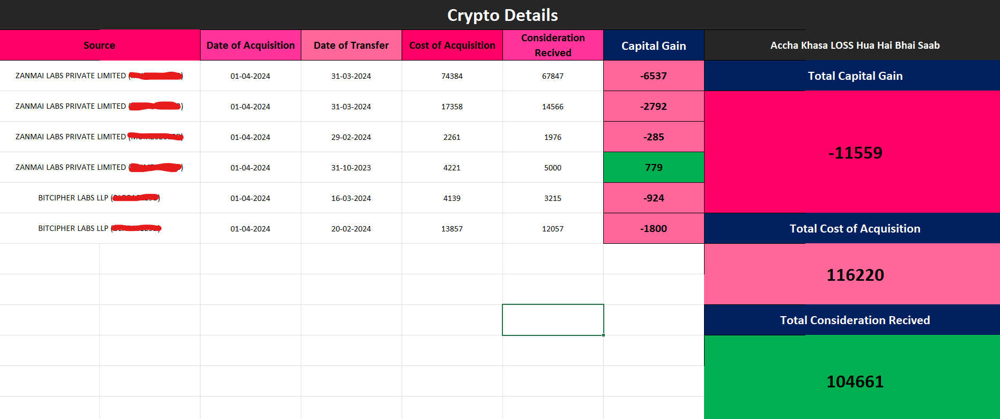
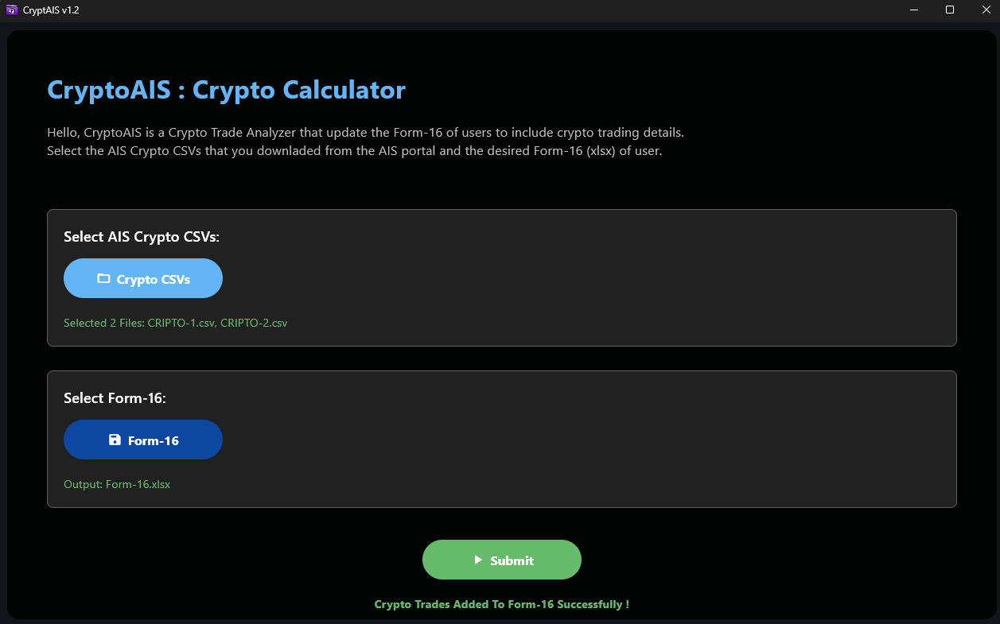
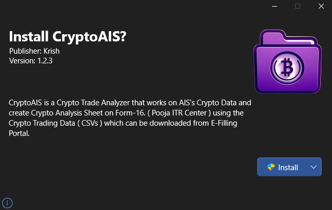

# CryptoAIS - *Crypto Trade Calculator* 🧮

## Overview 🕶️

**CryptoAIS** is a lightweight and powerful tool designed to automate **capital gain calculations on cryptocurrency trades**. It extracts trade data from **AIS Crypto CSVs** (downloaded from the [E-Filing Portal](https://eportal.incometax.gov.in/)) and directly fills the required details into your **Form-16 Excel template**.

This eliminates the need for manual entry and speeds up the filing process, especially for crypto traders who need to reflect their gains accurately in income tax filings.

> [!WARNING]
The software is created for **Pooja ITR Centre**, and is publicly available for use, but the Excel sheets like ITR-Format and Form-16 are kept private. Therefore, these sheets are not shared with this or any other software.

---

## Interface Preview 🖥️

### Crypto Capital Gain Dashboard

This is how the generated dashboard will look like:

<p align="center">
  <br>
  <strong>CryptoAIS Dashboard</strong>
</p>

### App UI

The clean, modern interface makes the entire process simple and intuitive:

<p align="center">
  <br>
  <strong>CryptoAIS Interface</strong>
</p>

### Installer

Includes a modern installer for smooth setup:

<p align="center">
  <br>
  <strong>Installing CryptoAIS</strong>
</p>

---

## What's New in v2.0.0 🚀

The **2.0.0** release brings first-class support for **Financial Year 2026** tax computations and ships a redesigned reporting dashboard.

### 🎯 Dashboard v2 (FY-2026)

A completely new dashboard layout is now generated inside the Form-16 workbook, with the following columns:

| #   | Column                 | Description                                                    |
| --- | ---------------------- | -------------------------------------------------------------- |
| A   | S.No                   | Sequential row index                                           |
| B   | Date of Acquisition    | Auto-generated acquisition date                                |
| C   | Date of Transfer       | Date of payment/credit from AIS                                |
| D   | Cost of Acquisition    | Computed cost basis                                            |
| E   | Consideration Received | Amount reported in AIS                                         |
| F   | Capital Gain           | `Consideration − Cost` (live formula)                          |
| G   | **TDS Deducted**       | `MAX(Capital Gain, 0)` — TDS applies only to gains, not losses |

A consolidated **Total** row is appended at the bottom of the dashboard, summing Cost of Acquisition, Consideration Received, Capital Gain, and TDS Deducted.

### 🔍 Smarter CSV Ingestion

* The CSV processor now **filters out non-active** records (status ≠ `active`) so cancelled or reversed AIS transactions are excluded automatically.
* Each combined row is tagged with a `from_file` column containing the **source CSV filename**, making it easy to trace any entry back to its origin.

### 🛠️ Reliability & Build Improvements

* Fixed a bug where the **last data entry was being overwritten** by the Total Row.
* Fixed an issue where the generated Form-16 did not have the **`crypto` worksheet set as active**, causing Excel to open on the wrong sheet.
* Corrected the project description and product name in `pyproject.toml`.
* Build pipeline is now driven by **Poetry** for deterministic, reproducible builds.
* Worksheet row buffer increased to **1000 rows** to comfortably handle large AIS exports.

---

## Features ✨

* Reads **crypto trade data** from AIS CSVs
* Automatically fills in **Form-16 Excel template**
* Eliminates manual data entry
* User-friendly file selection and update process
* Can be built as a **desktop app**, **web app**, or **Android APK**
* **FY-2026 ready** — new Dashboard v2 with TDS calculation
* **Active-only filtering** — ignores inactive/cancelled AIS transactions
* **Source tracking** — every row is tagged with the originating AIS CSV file
* **TDS Deducted** column — auto-computed from positive capital gains

---

## Installation ⬇️

You can download the latest version from the **[Releases](../../releases)** section of this repository.

---

## Build (Windows) ⚙️

Follow the steps below to build the application locally:

> **Requirement:** 💡
> `git` must be installed. Run `git -v` to check.

```powershell
git clone --no-checkout https://github.com/Krishna-Noutiyal/ITR-Kit.git
cd ITR-Kit
git sparse-checkout init
git sparse-checkout set crypto_calculator
git checkout main
cd crypto_calculator
.\build.ps1 -i
```

> The built application will be located inside `build/windows`.

---

## Usage ⚒️

Before using CryptoAIS, download your **crypto trade CSVs** from the [E-Filing Portal](https://eportal.incometax.gov.in/) and make sure you have a valid **Form-16 template**.

### Steps

1. Open the application
2. Select your **AIS crypto CSV files**
3. Select your **Form-16 Excel template**
4. Click **Submit** to auto-fill the capital gains section in Form-16

> [!NOTE]
> 📝 Ensure the **Form-16 template follows the expected structure**, as CryptoAIS maps the data to specific cells.

---

## Project Structure 📁

```text
crypto_calculator/
├── assets/              # UI assets like icons and images
├── config/              # UI themes and color settings
├── dashboards/          # Dashboard templates (dashboard_V1.xlsx, dashboard_V2.xlsx)
├── icons/               # App icons used in builds
├── routes/              # Page navigation and structure
├── scripts/             # Core logic to read/write Excel and CSV
├── ui/                  # Front-end components and layout
├── build.ps1            # Build & install script
├── main.py              # App entry point
├── pyproject.toml       # Project metadata (Poetry)
├── poetry.lock          # Locked dependency versions
├── requirements.txt     # Python dependencies
└── README.md            # This documentation
```

---

## Dependencies 🚴

CryptoAIS requires **Python 3.11+** and the following packages:

* `flet` (≥ 0.85.2)
* `flet-cli` (≥ 0.85.3)
* `flet-desktop` (≥ 0.85.3)
* `pandas` (≥ 3.0.3)
* `openpyxl` (≥ 3.1.5)
* `toml` (≥ 0.10.2)

### Install with `pip`

```bash
pip install -r requirements.txt
```

### Install with `poetry` (recommended for local development)

```bash
poetry install
```

---

## Sponsors & Rights 💰

The project is fully sponsored by **Pooja ITR Centre**, which provides all necessary funding. As a result, **Pooja ITR Centre** holds exclusive rights to the software.
